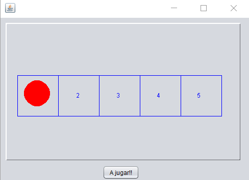

# Boxes the minigame

A small game in which you try to reach the end of a board of 5 squares with a certain sequence of numbers from 1 to 6, this sequence of numbers represents the rolls of a die.

The goal is to reach the last square of the board. Create the combination of winning rolls to finish the game through a `.txt` document as follows `3-5-1-5-6-6-6`

Features:

- Classic video game background music
- Sound of clapping when you win
- Through a plain text file the die rolls are entered

If you wish to support my content it would be super appreciated a help from you!

